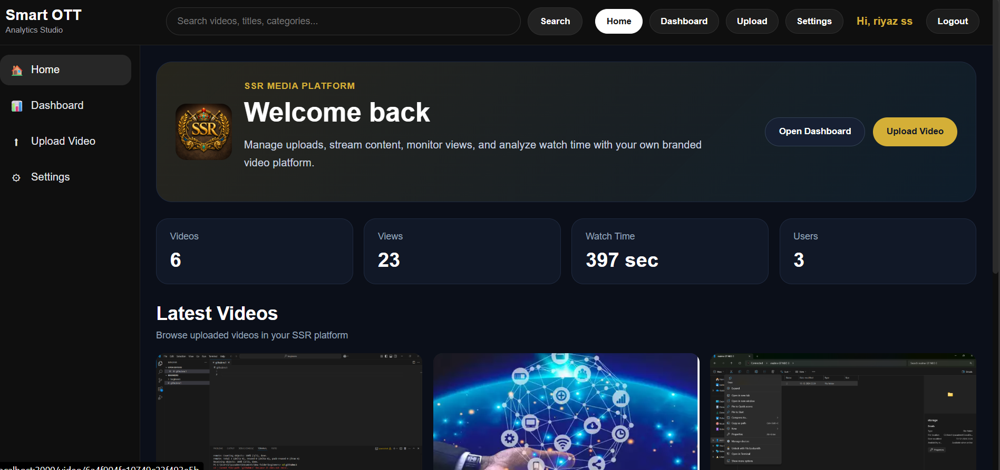
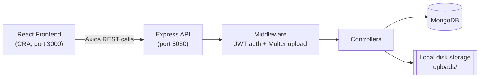
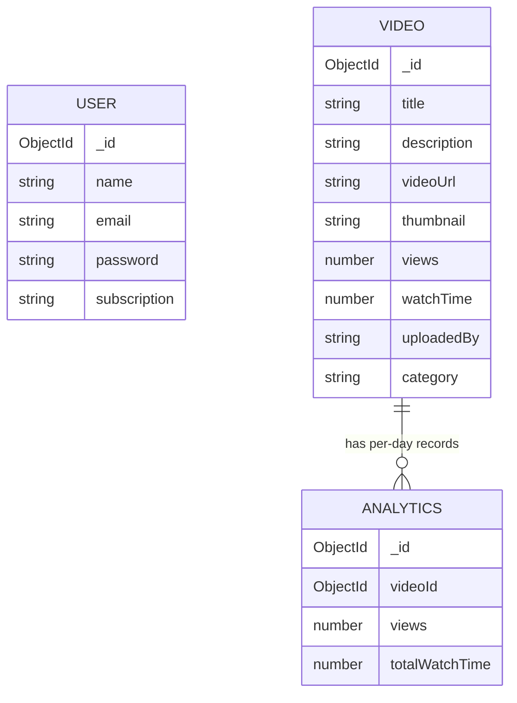

# 🎬 SmartOTT

SmartOTT is a full-stack video streaming and analytics platform designed to simulate real-world OTT application architecture. It enables users to securely authenticate, browse a media library, search content, and stream videos through an intuitive interface. The backend includes a comprehensive analytics engine that tracks video views, watch time, and engagement metrics using MongoDB aggregation pipelines, exposing an admin API for actionable insights. Built with the MERN stack, the project demonstrates production-ready concepts including JWT authentication, secure file uploads, RESTful API design, role-based access control, cloud storage integration, and scalable backend architecture.

## Table of Contents

- [Features](#features)
- [Screenshots](#screenshots)
- [Tech Stack](#tech-stack)
- [Architecture](#architecture)
- [Project Structure](#project-structure)
- [Getting Started](#getting-started)
- [Environment Variables](#environment-variables)
- [API Reference](#api-reference)
- [Data Models](#data-models)
- [Deployment](#deployment)
- [Roadmap](#roadmap)
- [Contributing](#contributing)
- [License](#license)
- [Author](#author)

## Features

- 🔐 **Authentication** — JWT register/login, with a protected `/auth/me` endpoint
- 🎥 **Video library** — upload with title, description, category, uploader, video file, and thumbnail (Multer)
- ▶️ **Playback page** — dedicated player with view/watch-time tracking and a recommendations rail
- 🔍 **Search & browse** — client-side search across title, description, and category
- 📊 **Analytics dashboard** — totals, a views/watch-time-over-time chart (Chart.js) with 7/28/90-day ranges, and a top-videos list
- 📈 **Analytics API** — per-video stats, trending, and most-watched endpoints (see [Roadmap](#roadmap) for what's not yet in the UI)
- 🛠️ **Admin-style stats API** — platform totals, recent users, top video (backend-only for now)

## Screenshots

\_

## Tech Stack

**Frontend** — React 19, React Router 7, Axios, Chart.js
**Backend** — Node.js, Express, MongoDB + Mongoose, JWT (`jsonwebtoken`) + `bcryptjs`, Multer
**Infrastructure** — Render (backend, deployed); MongoDB Atlas + Cloudinary (planned); Vercel/Netlify (frontend, planned)

## Architecture



## Project Structure

```
smartott/
├── backend/
│   ├── src/
│   │   ├── config/
│   │   │   └── db.js
│   │   ├── controllers/
│   │   │   ├── adminController.js
│   │   │   ├── analyticsController.js
│   │   │   ├── authController.js
│   │   │   ├── userController.js
│   │   │   └── videoController.js
│   │   ├── middleware/
│   │   │   ├── authMiddleware.js
│   │   │   └── upload.js
│   │   ├── models/
│   │   │   ├── Analytics.js
│   │   │   ├── User.js
│   │   │   └── Video.js
│   │   ├── routes/
│   │   │   ├── adminRoutes.js
│   │   │   ├── analyticsRoutes.js
│   │   │   ├── authRoutes.js
│   │   │   ├── userRoutes.js
│   │   │   └── videoRoutes.js
│   │   └── app.js
│   ├── uploads/
│   │   ├── videos/
│   │   └── thumbnails/
│   ├── .env.example
│   └── package.json
├── frontend/
│   ├── src/
│   │   ├── components/
│   │   │   ├── analyticscard.js
│   │   │   ├── navbar.js
│   │   │   ├── ProtectedRoute.js
│   │   │   ├── sidebar.js
│   │   │   └── videocard.js
│   │   ├── context/
│   │   │   └── AuthContext.js
│   │   ├── pages/
│   │   │   ├── dashboard.js
│   │   │   ├── home.js
│   │   │   ├── Login.js
│   │   │   ├── NotFound.js
│   │   │   ├── Register.js
│   │   │   ├── settings.js
│   │   │   ├── uploadvideo.js
│   │   │   └── VideoDetails.js
│   │   ├── services/
│   │   │   ├── api.js
│   │   │   └── videoServices.js
│   │   ├── App.js
│   │   └── index.js
│   └── package.json
├── .gitignore
├── LICENSE
└── README.md
```

## Getting Started

### Prerequisites

- [Node.js](https://nodejs.org/) 18+
- npm (bundled with Node.js)
- A MongoDB connection — a local `mongod` instance or a [MongoDB Atlas](https://www.mongodb.com/atlas) cluster

### 1. Clone the repo

```bash
git clone https://github.com/<your-username>/smartott.git
cd smartott
```

### 2. Backend

```bash
cd backend
npm install
cp .env.example .env
```

Fill in `MONGO_URI` and `JWT_SECRET` in `.env`, then start the server with whichever script your `backend/package.json` defines (commonly `npm start` or `npm run dev` — that file wasn't part of this review, so confirm it matches your actual entry point).

> **Heads up:** Multer writes uploads to `uploads/videos/` and `uploads/thumbnails/`, relative to wherever the server process runs (normally `backend/`). Those folders are empty after a fresh clone; `.gitkeep` placeholders are included so they still exist.

### 3. Frontend

```bash
cd ../frontend
npm install
npm start
```

Opens at `http://localhost:3000`. The API base URL is currently hardcoded to `http://localhost:5050` in `src/services/api.js` (and duplicated in a couple of components) — see [Roadmap](#roadmap).

## Environment Variables

Only the backend reads environment variables right now — the frontend doesn't consume any yet.

```env
# MongoDB connection string.
# Falls back to mongodb://127.0.0.1:27017/smartott if unset (see src/config/db.js)
MONGO_URI=

# Secret used to sign/verify JWTs.
# Falls back to an insecure hardcoded string if unset — always set this outside local dev.
JWT_SECRET=

# Port the Express server listens on.
PORT=5050
```

| Variable     | Required                               | Used in                                                                                    |
| ------------ | -------------------------------------- | ------------------------------------------------------------------------------------------ |
| `MONGO_URI`  | Recommended (has a local fallback)     | `src/config/db.js`                                                                         |
| `JWT_SECRET` | Recommended (has an insecure fallback) | `src/middleware/authMiddleware.js`, `src/controllers/authController.js`                    |
| `PORT`       | Optional                               | Server entry point (not part of this review — confirm it matches your `app.listen()` call) |

## API Reference

Base URL (local): `http://localhost:5050`

### Auth — `/auth`

| Method | Endpoint         | Description                        | Auth         |
| ------ | ---------------- | ---------------------------------- | ------------ |
| POST   | `/auth/register` | Register a new user, returns a JWT | Public       |
| POST   | `/auth/login`    | Log in, returns a JWT              | Public       |
| GET    | `/auth/me`       | Get the logged-in user's profile   | Bearer token |

### Users — `/users`

> Not yet behind auth — see [Roadmap](#roadmap).

| Method | Endpoint     | Description                                                                                                                          |
| ------ | ------------ | ------------------------------------------------------------------------------------------------------------------------------------ |
| GET    | `/users`     | List all users                                                                                                                       |
| POST   | `/users`     | Create a user — **currently unusable**: the schema requires a `password` this endpoint doesn't collect. Use `/auth/register` instead |
| GET    | `/users/:id` | Get a single user                                                                                                                    |
| PUT    | `/users/:id` | Update a user                                                                                                                        |
| DELETE | `/users/:id` | Delete a user                                                                                                                        |

### Videos — `/videos`

> Not yet behind auth — see [Roadmap](#roadmap).

| Method | Endpoint            | Description                                                                                                                 |
| ------ | ------------------- | --------------------------------------------------------------------------------------------------------------------------- |
| GET    | `/videos`           | List all videos                                                                                                             |
| POST   | `/videos`           | Upload a video — multipart form with `video` and `thumbnail` files                                                          |
| GET    | `/videos/:id`       | Get a single video                                                                                                          |
| PUT    | `/videos/:id`       | Update video metadata — file replacement is defined in the controller but not yet wired to Multer (see [Roadmap](#roadmap)) |
| DELETE | `/videos/:id`       | Delete a video                                                                                                              |
| POST   | `/videos/:id/view`  | Increment the view count                                                                                                    |
| POST   | `/videos/:id/watch` | Add watch time, in seconds                                                                                                  |

### Analytics — `/analytics`

> Not yet behind auth — see [Roadmap](#roadmap).

| Method | Endpoint                  | Description                                                                                                 |
| ------ | ------------------------- | ----------------------------------------------------------------------------------------------------------- |
| GET    | `/analytics/views`        | Total views across all videos                                                                               |
| GET    | `/analytics/watchtime`    | Total watch time across all videos                                                                          |
| GET    | `/analytics/top-video`    | The single most-viewed video                                                                                |
| GET    | `/analytics/videos`       | Per-video stats: views, watch time, average watch time                                                      |
| GET    | `/analytics/dashboard`    | Dashboard summary plus a views/watch-time time series. Accepts `?range=` of `7d`, `28d` (default), or `90d` |
| GET    | `/analytics/trending`     | Top 5 videos by views (not yet consumed by the frontend)                                                    |
| GET    | `/analytics/most-watched` | Top 5 videos by watch time (not yet consumed by the frontend)                                               |
| POST   | `/analytics/:id`          | Record a per-day view/watch-time event (not yet called from the frontend)                                   |

### Admin — `/admin`

> Not yet behind auth, and not yet surfaced in a frontend panel — see [Roadmap](#roadmap).

| Method | Endpoint              | Description                                                           |
| ------ | --------------------- | --------------------------------------------------------------------- |
| GET    | `/admin/stats`        | Platform totals: users, videos, views, watch time, subscription split |
| GET    | `/admin/videos`       | All videos                                                            |
| GET    | `/admin/users`        | All users                                                             |
| GET    | `/admin/top-video`    | Most-viewed video                                                     |
| GET    | `/admin/recent-users` | 5 most recently created users                                         |

## Data Models



- `Video.uploadedBy` is a plain string (an uploader name), not a reference to `User` — there's no ownership relationship enforced at the schema level yet.
- `Analytics` is meant to hold one document per video per day, but the schema doesn't currently declare the `date` field the controller relies on for that grouping (see [Roadmap](#roadmap)).

## Deployment

- **Backend** — deployed on [Render](https://render.com/). Environment variables are set in the Render dashboard, not committed to the repo.
- **Frontend** — not yet deployed; Vercel or Netlify are both a good fit for a Create React App build.

Planned for the next deploy cycle: MongoDB Atlas, Cloudinary, and a `FRONTEND_URL`-based CORS allowlist (see [Roadmap](#roadmap)).

## Roadmap

### Infrastructure

- [ ] Migrate MongoDB from a local instance to MongoDB Atlas
- [ ] Migrate file storage from Multer disk storage to Cloudinary (`multer-storage-cloudinary`)
- [ ] Replace the frontend's hardcoded `http://localhost:5050` with `process.env.REACT_APP_API_URL`
- [ ] Restrict CORS to an allowlist via `FRONTEND_URL` (currently `cors()` with no options — open to all origins)
- [ ] Deploy the frontend (Vercel or Netlify)

### Product / Code

- [ ] Add a `date` field to the `Analytics` schema — the controller already sets one, but Mongoose silently drops it since it isn't declared, which breaks the dashboard's day-by-day aggregation
- [ ] Attach Multer middleware to `PUT /videos/:id` — the controller has file-replacement logic, but the route doesn't parse multipart bodies, so it's currently a no-op
- [ ] Call `POST /analytics/:id` from the video player — it's fully implemented but not wired to playback events (views/watch time currently only go through `/videos/:id/view` and `/videos/:id/watch`)
- [ ] Build a frontend UI for `/analytics/trending` and `/analytics/most-watched`
- [ ] Build a frontend panel for the `/admin/*` endpoints (currently backend-only)
- [ ] Point user creation at `/auth/register` instead of `POST /users`, which can't succeed as-is since the `User` schema requires a `password` that route doesn't collect
- [ ] Add auth/role checks beyond `/auth/me` — video, user, and admin endpoints are all currently open
- [ ] Add request validation (e.g., Joi or Zod) so update endpoints don't persist arbitrary body fields as-is
- [ ] Wire up a catch-all route in `App.js` and flesh out `NotFound.js` (currently empty and not referenced by the router)

## Contributing

This is primarily a personal/portfolio project, but issues and PRs are welcome if you spot a bug or have a suggestion.

## Author

**Riyaz**

- LinkedIn:https://www.linkedin.com/in/riyazudeenss/
- GitHub:https://github.com/riyazudeenss63
